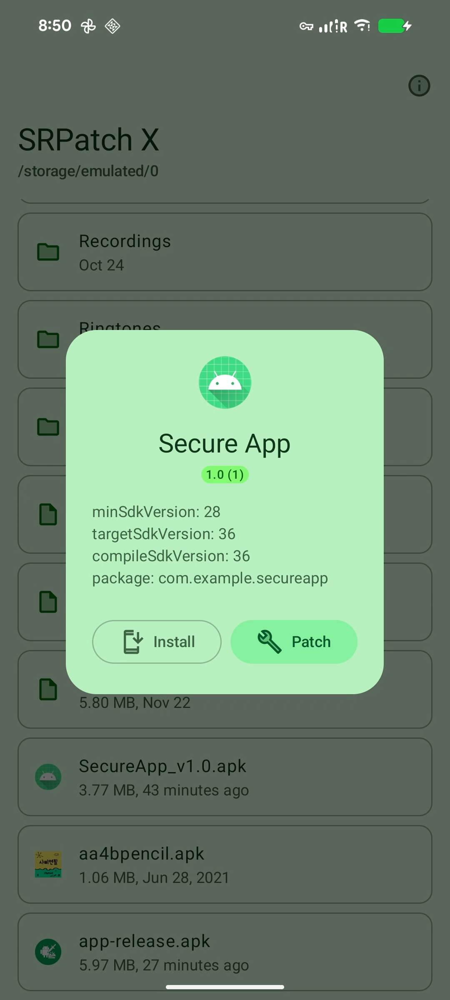
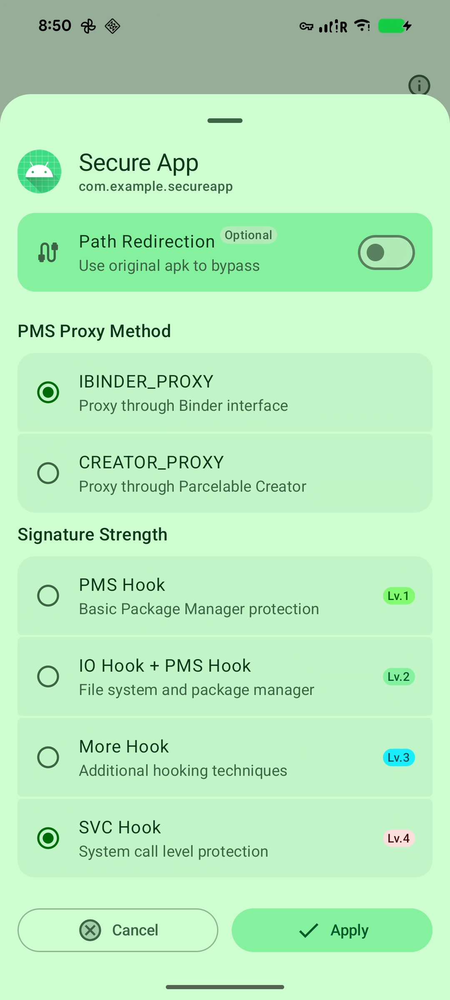
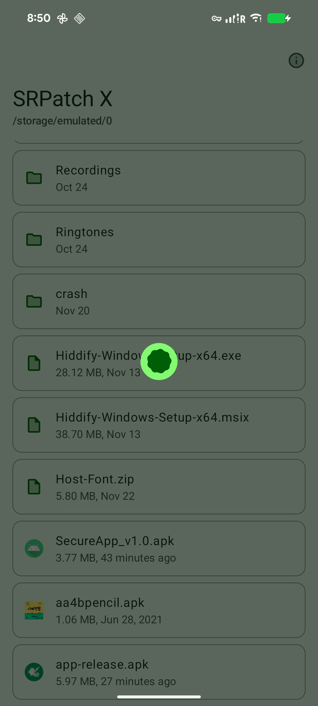
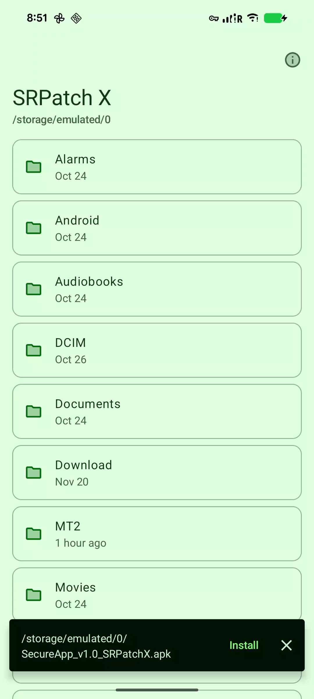

# SRPatch X 🔪

[SRPatch X](https://github.com/KhunHtetzNaing/SRPatch-X) is a modern Android APK signature
verification bypass tool featuring multiple hooking techniques:

- **Package Manager Hooking (PMS Hook)** - Intercepts signature checks at the system service level
- **File System Hooking (IO Hook)** - Blocks signature verification through direct file access
- **Supervisor Call Hooking (SVC Hook)** - Bypasses checks at the kernel system call level

## Features

- [x] Multiple signature bypass methods with configurable strength levels
- [x] Modern Material Design 3 UI
- [x] Path redirection for advanced protection
- [ ] APK signing capabilities with custom keystore support

## Note

**SRPatch X** is an extended version of **SRPatch** (`com.lingxing.srpatch`), originally developed
by **LingXing**. Since the original SRPatch is no longer maintained and its
website ([srpatch.cc](https://srpatch.cc/)) is offline, I've preserved the core functionality by
extracting `libSRPatch.so` and building this application around it.

**Enhancements over original SRPatch:**

- Added APK signing features
- Improved stability and compatibility

**Copyright Notice:**  
I do not own the "SRPatch" name or the `libSRPatch` core library. All rights remain with the
original developer, LingXing.

**Purpose:**  
Initially created for personal use, I'm sharing SRPatch X publicly for Android security researchers
and developers who may benefit from these tools.

## Disclaimer

This tool is intended for educational purposes and legitimate security research only. Users are
responsible for ensuring their use complies with applicable laws and terms of service. The author
assumes no liability for misuse.

## Requirements

- **Device:** Android 8.0+ (API 26+)
- **Architecture:** arm64-v8a only

## Downloads

Download the latest version from the [Releases](releases) page.

  
  
  
  

